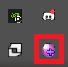

### 증권사 API 사용방법
1. 대신증권 크레온 API 설치 파일을 다운로드 합니다.

   [다운로드 링크](https://www.creontrade.com/g.ds?m=2194&p=12294&v=11951)
2. CREON HTS의 다운로드 버튼을 클릭해, 설치파일을 받습니다. 
3. 대신증권 크레온 API를 호출하기 위해서는 파이썬 32비트 버전으로 아나콘다 환경을 변경하고 win32com 패키지를 한꺼번에 설치한다.
   1. 아나콘다 32비트로 바꾸기 및 파이썬을 3.6버전으로 설치 
   ```commandline
   # 32비트 환경 설정하기 
   conda config --env --set subdir win-32
   conda info #환경 변경된 것확인
   
   # 32비트 활성화
   conda create -n py36_32 python=3.6
   conda activate py36_32
   
   ```
   2. win32com 설치하기
   ```commandline
   python -m pip install pywin32
   ```
   3. win32com 확인해보기 
   ```python
   import win32com.client
   ```

4. 대신증권 크레온 HTS 실행하고, creon plus에 로그인합니다. (아이디와 비밀번호 입력후에 조회전용으로 로그인할 것)
5. 아래에 크레온 플러스 아이콘이 생겼는지 확인할 것


6. creon.py를 실행할 것.
7. 데이터를 csv파일 형식으로 저장하고, 이것을 data/{ver}/데이터 이름으로 저장할 것

※ 주의 : 사용중에 모바일 어플로 접근하면, 접속이 해제됨

다시 64비트로 되돌리는법
```commandline
# 64비트 환경으로 되돌리기
   conda config --env --set subdir win-64
   conda info # 환경 변경된 것 확인
```
